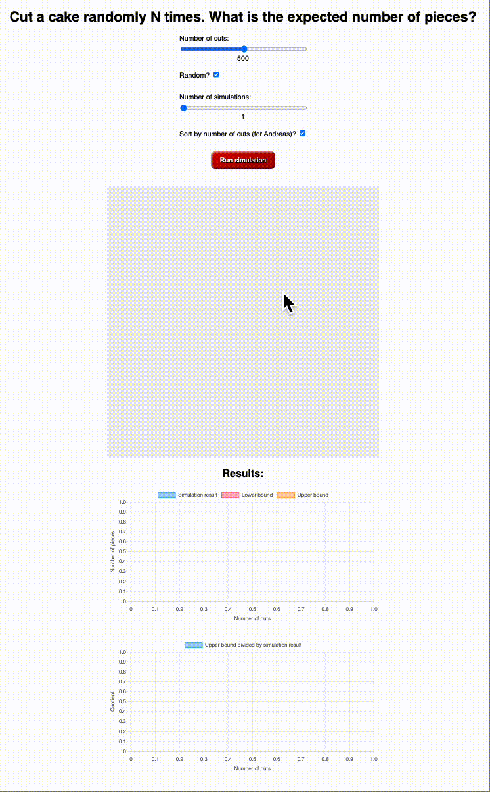

# GHC WebAssembly Backend Demonstration - ZuriHac 2024

At ZuriHac 2024, [Jane Street](https://www.janestreet.com/) was giving out
shirts with the following prompt on the back:

I was looking to do something with [GHC's WebAssembly (wasm)
backend](https://ghc.gitlab.haskell.org/ghc/doc/users_guide/wasm.html), so I
decided to solve the problem above using a WebAssembly simulation in the
browser.

Here it is in action:

All of the logic for this simulation is written in Haskell and compiled to wasm,
including:

- Concurrent execution of each simulation
- Mutex protecting the HTML canvas rendering context
- Randomness using the [random](https://hackage.haskell.org/package/random)
  package

No libraries were used for interacting with the DOM, just raw JavaScript FFI
through the wasm backend.

## Build it and try it yourself

The [ghc-wasm-meta](https://gitlab.haskell.org/ghc/ghc-wasm-meta) README is a
good resource for setting up a wasm cross compilation toolchain. The GHC team
does supply official distributions of wasm cross compilers for Linux, but not
other platforms (yet). On other platforms (e.g. macOS), you will need to build a
cross compiler from source.

Once you have a toolchain set up, you can simply run the `./build.sh` file in
this repository and serve the `dist` directory on a local file server.

## Credits:

- Finley McIlwaine (author)
- Andreas Klebinger ([@wz1000](https://github.com/AndreasPK))
- Zubin Duggal ([@wz1000](https://github.com/wz1000))
- [ZuriHac 2024](https://zfoh.ch/zurihac2024/)
